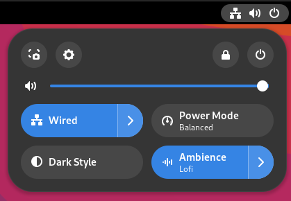
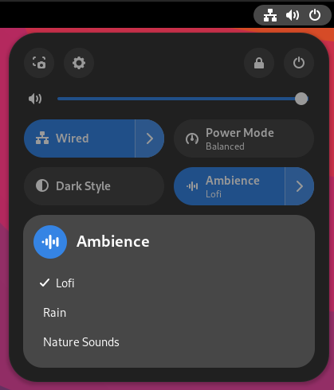
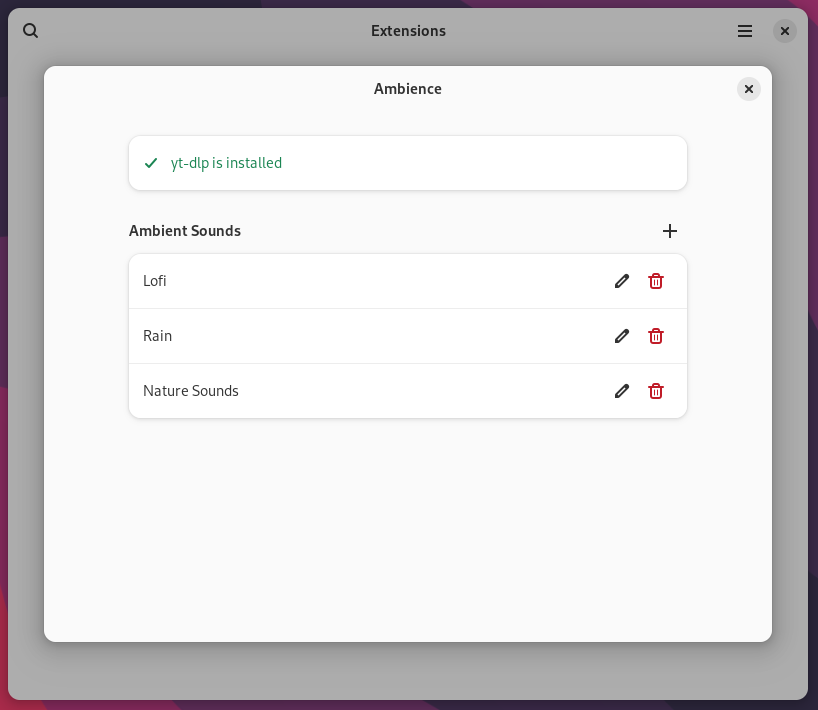

# gnome-shell-ambience-extension
Listen to ambient sounds distraction free from the quick settings menu

You can add ambient sounds from:

- your local files
- web-url's
- YouTube Videos / LiveStreams (*)

> (*) requires [ytl-dlp](https://github.com/yt-dlp/yt-dlp) to be installed on your system

## Screenshots
Quick Settings Menu





Settings



## Installation & Build from source
You can manually install the extension by cloning the repository:
```
git clone https://github.com/snensmens/gnome-shell-ambience-extension.git

cd gnome-shell-ambience-extension/ambience@github.snensmens.com

gnome-extensions pack --force --extra-source=resources/ --extra-source="communication.js" --extra-source="player.js"
gnome-extensions install ambience@github.snensmens.com.shell-extension.zip --force
```

If you want to build the extension you can use the `build.sh` script. For this you will have to have [blueprint-compiler](https://jwestman.pages.gitlab.gnome.org/blueprint-compiler/index.html) installed on your system.

## Acknowledgement
Ambience is inspired by [lowfi](https://github.com/talwat/lowfi)
